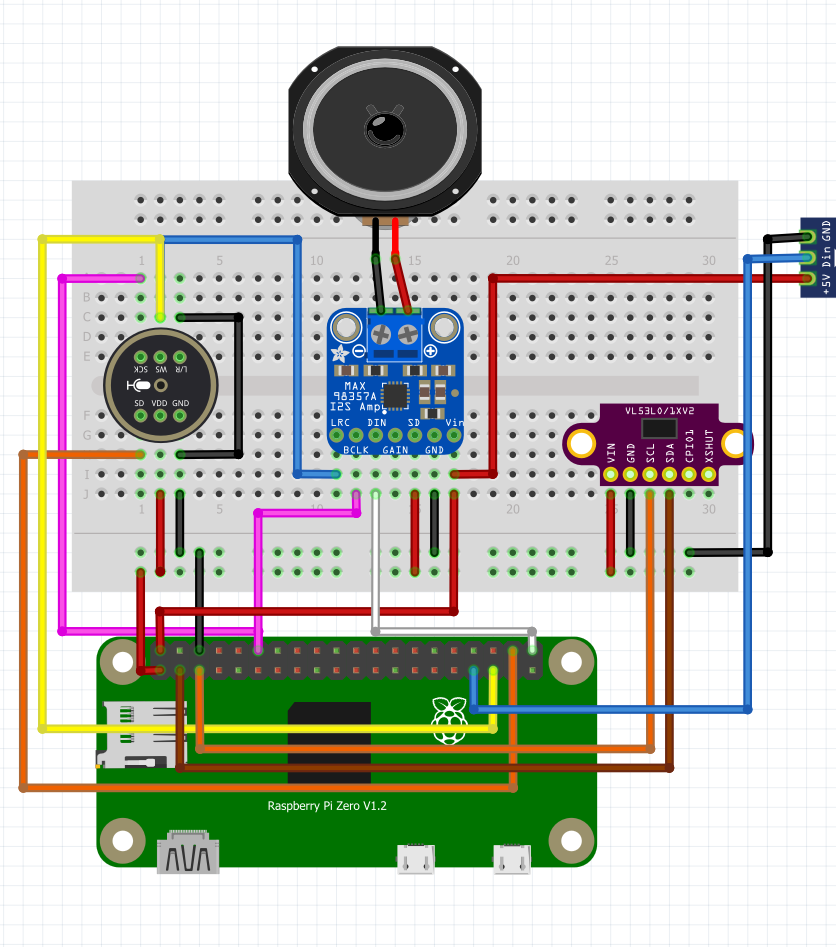

# BOTMAKS – Intelligent Voice Assistant for Raspberry Pi

> **A hands-free voice assistant powered by Google Gemini with advanced sensors and visual feedback**

## 🚀 Main Features

BOTMAKS is a **completely hands-free** voice assistant designed for Raspberry Pi Zero/Zero W that combines:

- 🎯 **Automatic activation** via ToF VL53L0X proximity sensor (≤10 cm)
- 🎤 **Professional I²S Audio** with INMP441 microphone and MAX98357A amplifier
- 🤖 **Artificial Intelligence** powered by Google Gemini (STT + conversation + TTS)
- 💡 **Visual Feedback** with WS2812 LED ring (35-36 LEDs) to indicate status
- ⚡ **Plug & Play** - main script `talk_5s_gemini_tof_led.py` ready to use

### 🎭 How It Works
  1. **Get close** to the device (≤10 cm) → the ToF sensor detects presence
  2. **Speak** for 5 seconds → the I²S microphone records high-quality audio
  3. **Wait** → Gemini processes the request and generates an intelligent response
  4. **Listen** → the response is played via TTS on the I²S speaker
  5. **Observe** → the LEDs show the status in real time with colorful animations

---

## 🎨 LED Behavior
- **Standby:** off  
- **Listening (ToF trigger):** 2 **cyan** flashes  
- **Loading/Processing:** **blue/violet** scrolling effect  
- **Speaking (TTS):** **blue/violet** “breathing”  

---

## 🔧 Hardware Required

### 🛒 **Components List with Purchase Links**
In qualità di Affiliato Amazon, ricevo un guadagno dagli acquisti idonei. - As an Amazon Associate, I earn from qualifying purchases.
| Component | Description | Purchase Link |
|------------|-------------|---------------|
| **Raspberry Pi Zero W** | Main microcomputer | [🛒 Buy on Amazon](https://amzn.to/4mk3E4O) |
| **VL53L0X** | Time-of-Flight (ToF) sensor on I²C | [🛒 Buy on Amazon](https://amzn.to/3K3SuUF) |
| **INMP441** | Professional I²S microphone | [🛒 Buy on Amazon](https://amzn.to/46ouB1v) |
| **MAX98357A** | I²S audio amplifier | [🛒 Buy on Amazon](https://amzn.to/41XfT09) |
| **WS2812 Ring** | 35-36 programmable LEDs | [🛒 Buy on Amazon](https://amzn.to/4mh8YpB) |
| **Speaker** | Speaker for audio output | [🛒 Buy on Amazon](https://amzn.to/4nENIvo) |

### 🏗️ **3D Structure**
📦 **Download the STL files for the structure**: [**MakerWorld - BOTMAKS Structure**](https://makerworld.com/it/models/1802740-botmaks-a-next-gen-voice-assistant-beyond-alexa#profileId-1922529)

### ⚡ **Additional Requirements**
- Adequate 5V power supply (LEDs may require significant current)
- [**5.5mm DC Connector**](https://amzn.to/3KpGCw8) - Power connector kit
- Jumper wires for connections
- Breadboard or PCB for prototyping (optional)

### 🔌 Connections (Raspberry pins)


*Visual diagram of hardware connections for BOTMAKS*

**I²S (common to mic + speaker):**
- **GPIO18 / BCLK** (pin 12) → BCLK of INMP441 and MAX98357A  
- **GPIO19 / LRCLK/WS** (pin 35) → LRC/WS of INMP441 and MAX98357A  

**Data:**
- **GPIO21 / PCM_DOUT** (pin 40) → **DIN** (MAX98357A)  
- **DOUT (INMP441)** → the microphone exposes SD/DOUT to the Pi (I²S reading)

**Power Supplies:**
- **INMP441:** 3.3 V & GND  
- **MAX98357A:** 5 V & GND  

**ToF (I²C):**
- **SDA:** GPIO2 (pin 3)  
- **SCL:** GPIO3 (pin 5)  
- **VIN:** 3.3 V (or 5 V if the breakout allows), **GND**  
- **XSHUT:** recommended pull-up to 3.3 V (10 k)

**WS2812 LED (via PWM):**
- **DIN:** **GPIO13** (pin 33, PWM1)  
- **5 V** and **GND** common to the Pi

---

## ⚙️ System & Enablements
Raspberry Pi OS (Lite recommended). Enable:
```bash
sudo raspi-config
# Interface Options → I2C → Enable
# Interface Options → Audio I2S enabled (depending on the image)
```

Config **/boot/firmware/config.txt** (example):
```ini
dtparam=i2c_arm=on
dtparam=i2s=on
dtoverlay=max98357a
# overlay microphone I²S (varies by image):
# dtoverlay=i2s-mic      # if present
# (alternative: dtoverlay=googlevoicehat-soundcard)
```
> Do not enable multiple conflicting audio overlays.

Reboot:
```bash
sudo reboot
```

---

## 📦 Installation Dependencies
```bash
sudo apt update
sudo apt install -y python3-venv python3-pip ffmpeg alsa-utils i2c-tools
python3 -m venv ~/assistente
source ~/assistente/bin/activate
pip install -U pip
pip install requests adafruit-blinka adafruit-circuitpython-vl53l0x rpi-ws281x
```

---

## 🔑 Gemini API Key Configuration
1. Access **Google AI Studio** (Gemini API) with your Google account.  
2. Create an **API key**.  
3. **Do not** commit it to GitHub. Save it as an environment variable on the device.

Examples:
```bash
# current session
export GEMINI_API_KEY="your_key"
export MIC_DEVICE="hw:0,0"   # if the ALSA device is different, change it

# manual start (requires root for LEDs via /dev/mem)
sudo --preserve-env=GEMINI_API_KEY,MIC_DEVICE /home/botmaks/assistente/bin/python /home/botmaks/talk_5s_gemini_tof_led.py
```

---

## 🚀 Automatic Startup as a Service (systemd)
**1) Variables in /etc/default**
```bash
sudo tee /etc/default/botmaks-assistant >/dev/null <<'EOF'
GEMINI_API_KEY=INSERT_YOUR_KEY
MIC_DEVICE=hw:0,0
EOF
```

**2) Systemd Unit**
```bash
sudo tee /etc/systemd/system/botmaks-assistant.service >/dev/null <<'EOF'
[Unit]
Description=Botmaks Assistant (ToF + LEDs + Gemini)
Wants=network-online.target
After=network-online.target sound.target

[Service]
Type=simple
User=root
WorkingDirectory=/home/botmaks
EnvironmentFile=/etc/default/botmaks-assistant
ExecStart=/home/botmaks/assistente/bin/python /home/botmaks/talk_5s_gemini_tof_led.py
Restart=on-failure
RestartSec=3
StandardOutput=journal
StandardError=journal

[Install]
WantedBy=multi-user.target
EOF
```

**3) Enable & Start**
```bash
sudo systemctl daemon-reload
sudo systemctl enable --now botmaks-assistant
```

**4) Logs & Management**
```bash
sudo systemctl status botmaks-assistant
sudo journalctl -u botmaks-assistant -f
sudo systemctl restart botmaks-assistant
sudo systemctl stop botmaks-assistant
```

---

## 🎮 Manual Usage
```bash
# with WS2812 LED on GPIO13 requires root
sudo --preserve-env=GEMINI_API_KEY,MIC_DEVICE /home/botmaks/assistente/bin/python /home/botmaks/talk_5s_gemini_tof_led.py
```
- Approach the hand to **≤10 cm** → 2 cyan blinks → 5 s recording  
- **Violet** LED during processing → blue/violet “breathing” LED while speaking  
- End → LEDs off

---

## 🔍 Test and Diagnostics
**ToF:**
```bash
ls /dev/i2c*                 # there should be /dev/i2c-1
sudo i2cdetect -y 1          # should show 0x29
```

**Audio:**
```bash
arecord -l                   # see capture devices
aplay -l                     # see playback devices
# your I²S often uses S32_LE; try:
aplay -D hw:0,0 file_s32le.wav
# or automatic conversion:
aplay -D plughw:0,0 any.wav
amixer sset Master 95% || amixer sset PCM 95%
```

**LED:**
- DIN → **GPIO13** (pin 33), 5 V, common GND  
- Run script as **root** (rpi_ws281x uses /dev/mem)  
- If `mmap()`/`ws2811_init` error: reboot and check that GPIO13 is free (we use **PWM1**, does not conflict with I²S)

---

## 📁 Project Structure
```
.
├── talk_5s_gemini_tof_led.py   # main script
├── README.md
└── .gitignore                  # add secret files here (never the key!)
```

**.gitignore Suggestion**
```
# secrets/environment
.env
*.key
*.pem
/etc/default/botmaks-assistant
```

---

## ⚠️ Important Notes & Security
- Do not commit **API key**.  
- **GND** common among all modules.  
- For I²C stability on PCB: 4.7 k pull-up on SDA/SCL and bypass capacitors near the modules.  
- If the audio accepts only **S32_LE**, convert the WAV to S32_LE 48 kHz stereo or use `plughw`.

---

## 📄 License
Choose the license you prefer (e.g. MIT). Example:

```
MIT License — see LICENSE
```

---

## 🌟 Technical Features

| Component | Specification | Notes |
|-----------|---------------|-------|
| **Platform** | Raspberry Pi Zero/Zero W | Compatible with Pi 3/4 |
| **Proximity Sensor** | VL53L0X ToF | Activation ≤10cm |
| **Audio Input** | INMP441 I²S | Professional quality |
| **Audio Output** | MAX98357A I²S | Integrated amplifier |
| **Visual Feedback** | WS2812 LED Ring | 35-36 programmable LEDs |
| **AI Engine** | Google Gemini | STT + Conversation + TTS |
| **Language** | Python 3 | Optimized libraries |

## 🤝 Contributions

Contributions are welcome! Please:
1. Fork the project
2. Create a branch for your feature (`git checkout -b feature/AmazingFeature`)
3. Commit your changes (`git commit -m 'Add some AmazingFeature'`)
4. Push to the branch (`git push origin feature/AmazingFeature`)
5. Open a Pull Request

## 📞 Support

If you have problems or questions:
- Open an **Issue** on GitHub
- Check the **🔍 Test and Diagnostics** section for common issues
- Verify that all hardware connections are correct

---

## 📺 Follow Us for Other Projects

✍️ **Follow the Ingeimaks channel for new ESP32 projects and other electronics, Arduino and 3D printing content!**

🔗 [**Ingeimaks Channel**](https://www.youtube.com/Ingeimaks) - Discover other innovative projects!

---

<div align="center">

**⭐ If this project has been useful to you, leave a star on GitHub! ⭐**

*Made with ❤️ for the Raspberry Pi community*

</div>
